# 4. PROJETO DO DESIGN DE INTERAÇÃO

## 4.1 Personas
  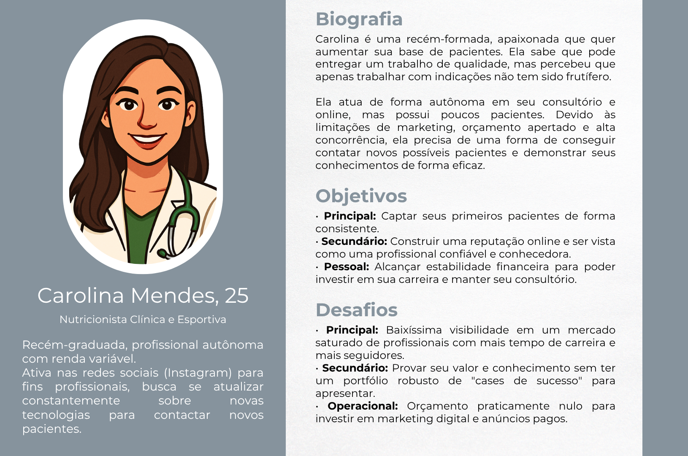
  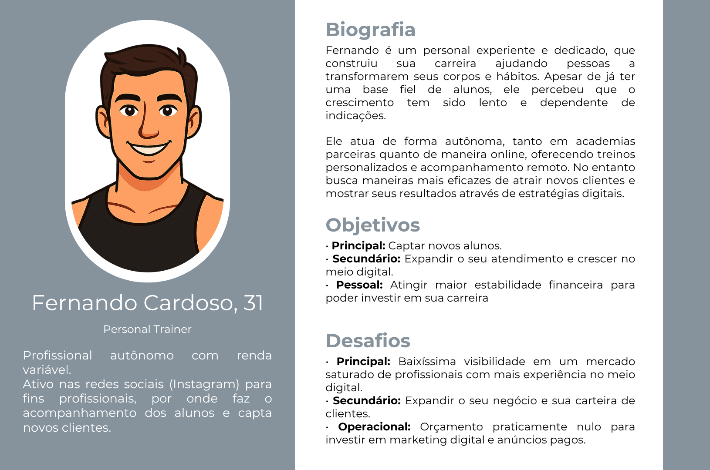
  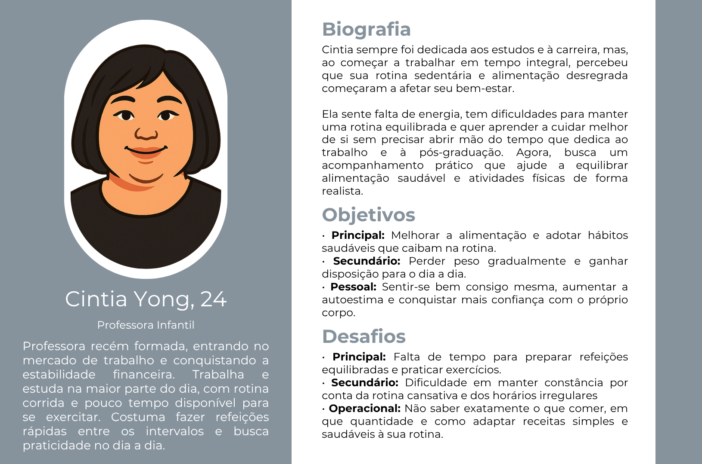
  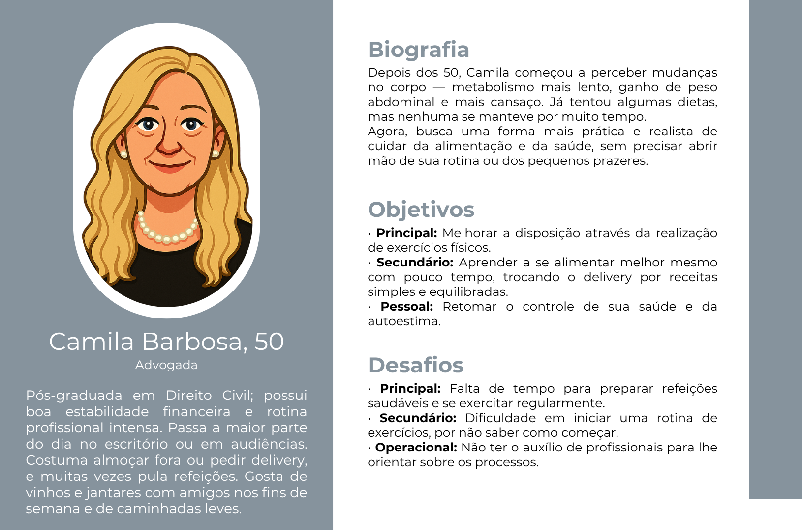
  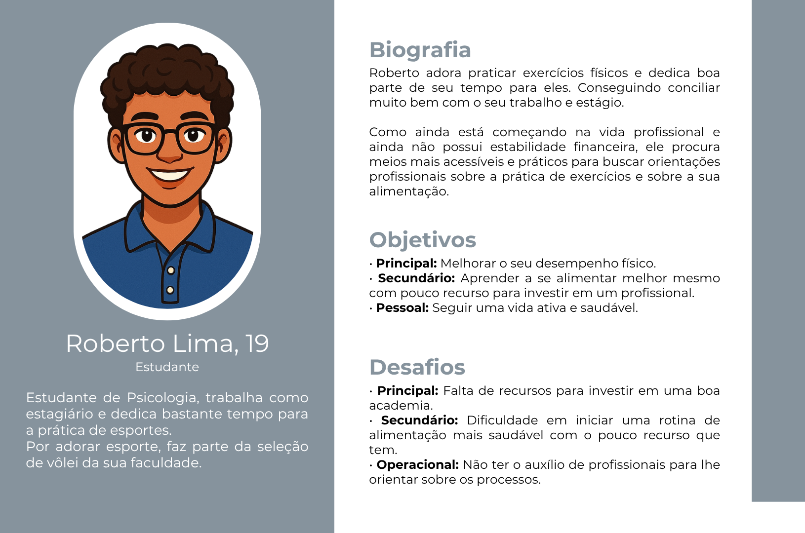
  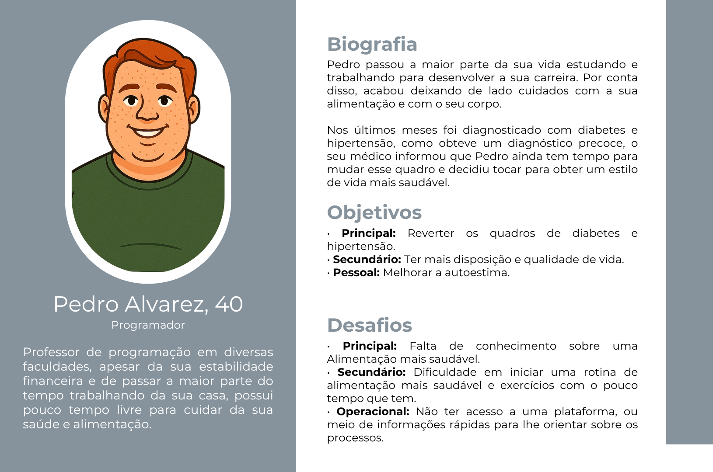

## 4.2 Mapa de Empatia
  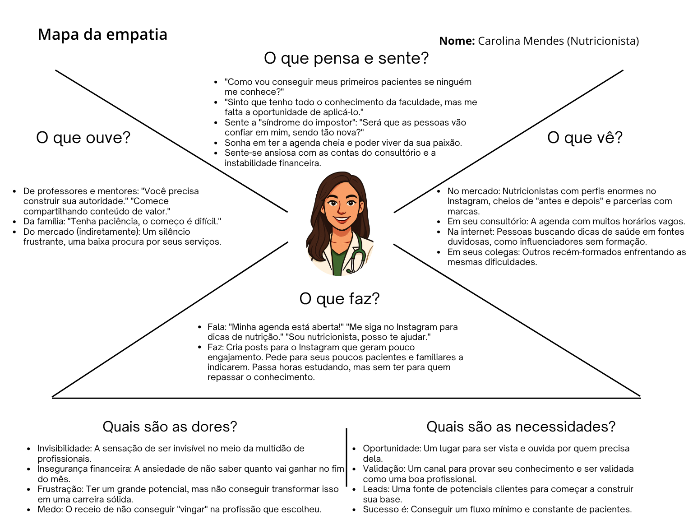
  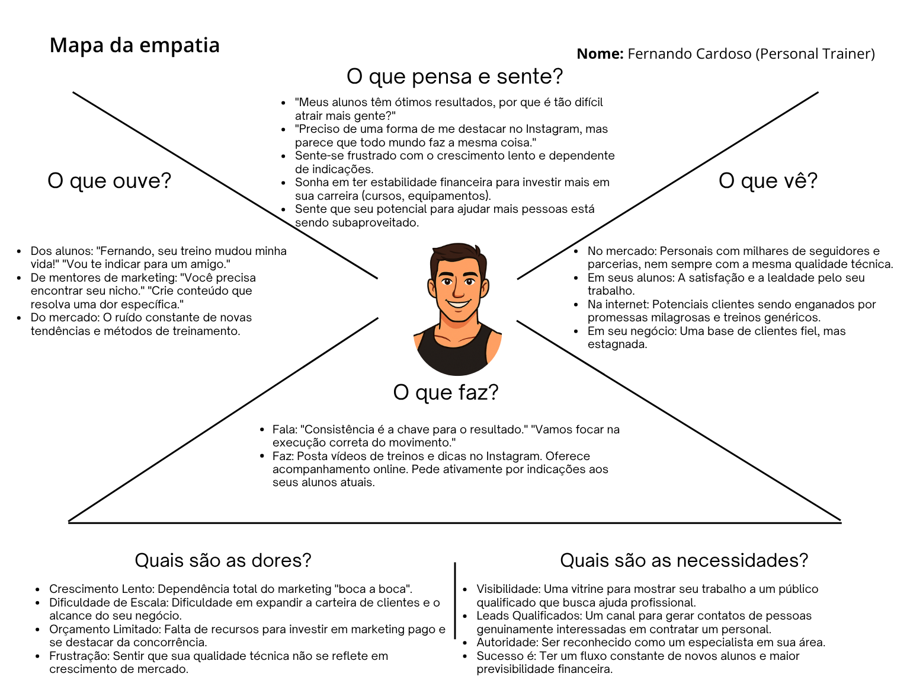
  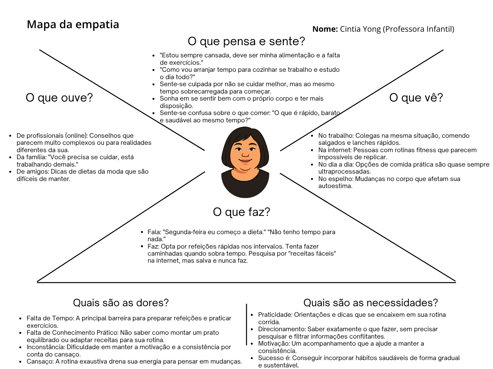
  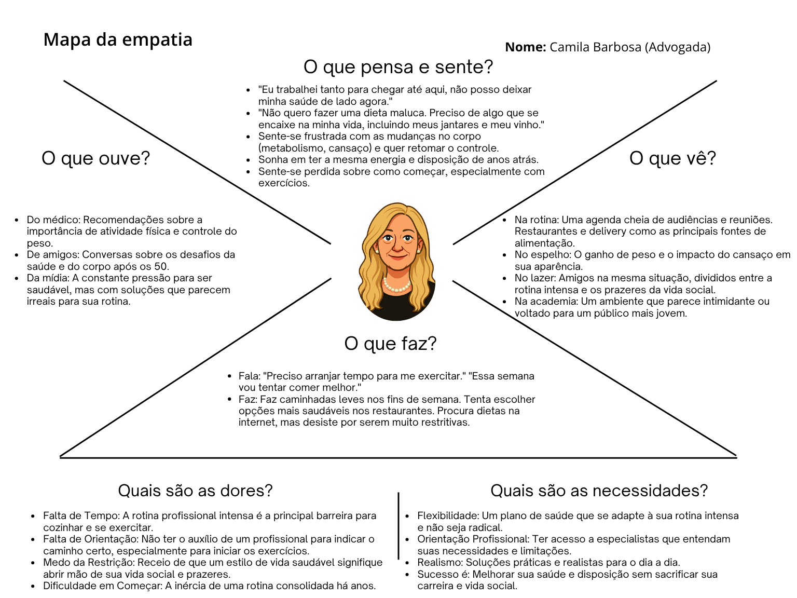
  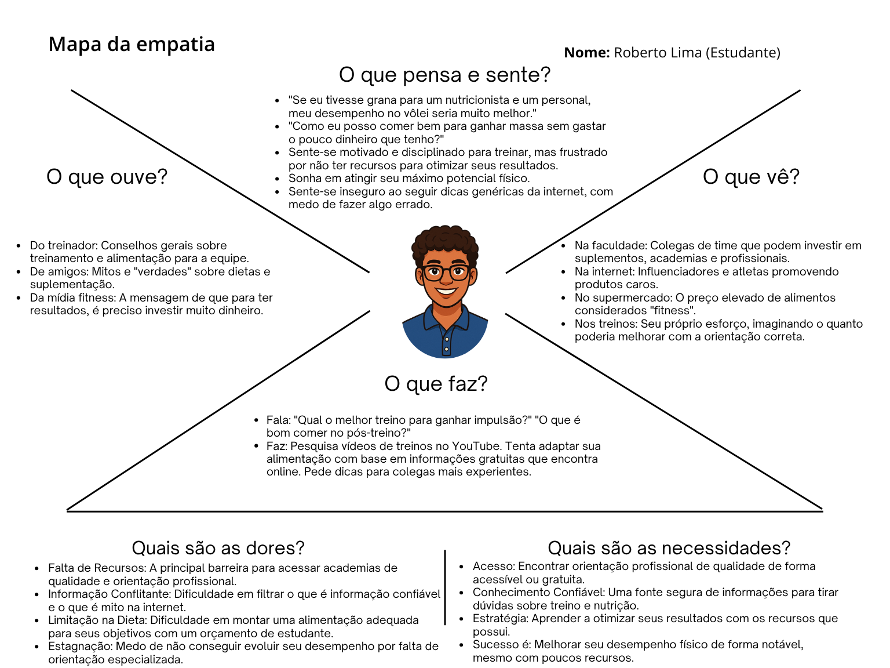
  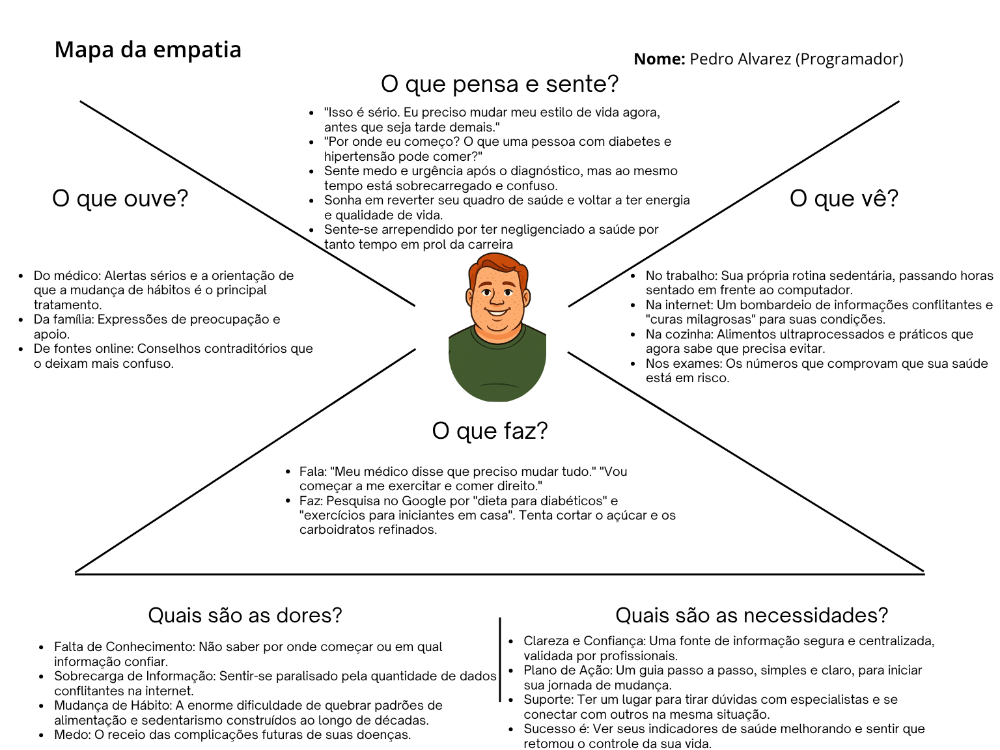

## 4.3 Protótipos das Interfaces

### Tela: Landing Page

A **Meta Principal** da Landing Page – Nutri é **apresentar a proposta de valor** da aplicação, destacando seus benefícios e **convidando o usuário a criar uma conta** ou iniciar sua jornada alimentar. Ela deve **comunicar de forma visual e textual a ideia central** do produto (acompanhamento nutricional e bem-estar), e deve **estimular a conversão** com CTAs (Call to Action) claros como “Comece já” e “Criar conta”, além de **transmitir credibilidade e empatia**.

#### Princípios Gestálticos
* **Proximidade:** Os elementos são organizados em seções bem delimitadas, com espaçamento generoso, o que ajuda o usuário a identificar diferentes grupos de informação (hero, benefícios, depoimentos).
* **Semelhança:** Ícones e cartões seguem o mesmo estilo visual (bordas suaves, ícones verdes, tipografia uniforme), reforçando a unidade e a coerência.
* **Continuidade:** A leitura flui naturalmente de cima para baixo, guiada por uma hierarquia clara: título $\rightarrow$ subtítulo $\rightarrow$ CTA.
* **Figura-fundo:** O uso de fundo branco e cinza-claro cria contraste com textos e elementos interativos verdes, destacando áreas de interesse (botões e títulos).
* **Pregnância (ou boa forma):** As seções têm formas simples e simétricas, facilitando a compreensão imediata. O design minimalista foca nas mensagens principais.
* **Fechamento:** Cartões com bordas suaves e blocos bem definidos criam a percepção de “contêineres” de informação.

#### Regras de Ouro da Interação
* **Consistência:** Paleta de cores (verde, branco e cinza), tipografia e espaçamento mantêm uniformidade em toda a página. Botões seguem o mesmo estilo, o que cria reconhecimento imediato da ação.
* **Feedback visual:** Botões e links oferecem contraste suficiente, indicando claramente sua interatividade.
* **Prevenção de erros:** A ausência de sobrecarga cognitiva ou múltiplos caminhos reduz chances de cliques incorretos, focando na ação de conversão.
* **Minimizar carga de memória:** As informações são apresentadas de forma sequencial e visual, sem exigir que o usuário memorize dados entre seções.
* **Controle e liberdade do usuário:** O usuário pode explorar o conteúdo antes de tomar uma ação.
* **Estética e design minimalista:** O layout prioriza o conteúdo e o espaço em branco, evitando ruídos visuais.

#### Recomendações Ergonômicas
* **Agrupamento lógico de informações:** Cada seção apresenta um propósito único (benefícios, estatísticas, depoimentos), o que facilita a leitura e reduz a carga cognitiva.
* **Legibilidade:** Tipografia em preto e verde sobre fundo branco garante contraste ideal. Títulos e subtítulos usam hierarquia visual adequada.
* **Compatibilidade com o usuário:** Linguagem clara e próxima do cotidiano, sem termos técnicos. O texto fala diretamente com o público-alvo.
* **Minimização da carga de trabalho:** O CTA principal aparece várias vezes na página, evitando que o usuário precise voltar ao topo para agir.
* **Acessibilidade visual e motora:** Botões têm tamanho adequado para clique, espaçamento suficiente e boa distinção de cor.
* **Foco na tarefa principal:** Todo o fluxo visual leva o usuário ao mesmo objetivo — iniciar sua jornada ou criar conta.

### Tela: Cadastro do Usuário

A **Meta Principal** da tela Cadastro do Usuário é **permitir que novos usuários criem uma conta** na plataforma Nutri inserindo suas informações básicas (nome, e-mail, tipo de perfil e senha). Ela deve servir como **primeira etapa do processo de onboarding**, garantindo que os dados essenciais sejam coletados de forma **simples e segura**, e deve criar uma experiência de entrada **clara e intuitiva**, com foco na confiabilidade e facilidade de uso.

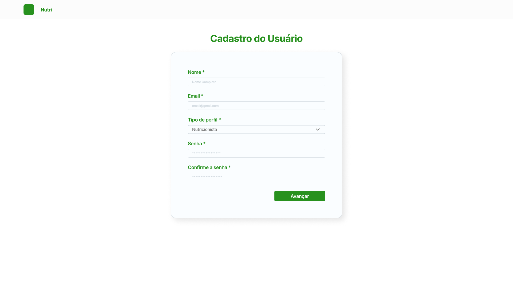

#### Princípios Gestálticos
* **Proximidade:** Campos relacionados estão agrupados logicamente (dados pessoais e de acesso). O botão “Avançar” se encontra logo abaixo, reforçando a sequência natural de preenchimento.
* **Semelhança:** Todos os campos de input têm o mesmo formato, cor e espaçamento, reforçando a percepção de pertencimento ao mesmo grupo funcional.
* **Continuidade:** A disposição vertical dos campos guia o olhar do usuário de cima para baixo, seguindo um fluxo natural de leitura.
* **Figura-fundo:** A caixa branca com sombra suave se destaca do fundo cinza-claro, indicando o espaço de interação principal.
* **Fechamento:** A moldura arredondada e o uso de sombra criam um bloco visual coeso, que delimita o formulário.

#### Regras de Ouro da Interação
* **Consistência:** Mantém o padrão visual de outras telas do sistema (cores verde e branca, tipografia simples, botões arredondados).
* **Feedback:** O botão “Avançar” em verde comunica claramente a ação primária e dá feedback imediato sobre o próximo passo.
* **Minimizar Carga de Memória:** Campos possuem placeholders explicativos (“Nome completo”, “email@gmail.com”), reduzindo a necessidade de relembrar formatações.
* **Prevenção de Erros:** Campos obrigatórios são sinalizados com asterisco (*), orientando o usuário sobre o preenchimento necessário.
* **Controle e liberdade:** O usuário pode revisar suas informações antes de avançar, garantindo autonomia durante o cadastro.

#### Recomendações Ergonômicas
* **Agrupamento visual:** O formulário está centralizado, facilitando o foco e diminuindo movimentos oculares desnecessários.
* **Legibilidade:** Boa hierarquia de texto: título principal em verde e maior contraste com o fundo.
* **Compatibilidade com o usuário:** Linguagem direta e amigável, com termos comuns (“Nome”, “Senha”, “Confirmar senha”).
* **Minimização da carga de trabalho:** Poucos campos e estrutura simples reduzem o tempo de preenchimento.
* **Acessibilidade:** Campos grandes e espaçados permitem fácil interação tanto em desktop quanto em dispositivos móveis.

### Tela: Nos fale sobre você

A **Meta Principal** da tela Nos fale sobre você é **coletar informações complementares** sobre o perfil e os objetivos do usuário, como peso, altura, idade, gênero e metas pessoais. Ela deve **personalizar a experiência** dentro da plataforma, permitindo que o acompanhamento nutricional seja ajustado às características individuais, e deve servir como **segunda etapa do cadastro**, finalizando o processo de criação de conta.

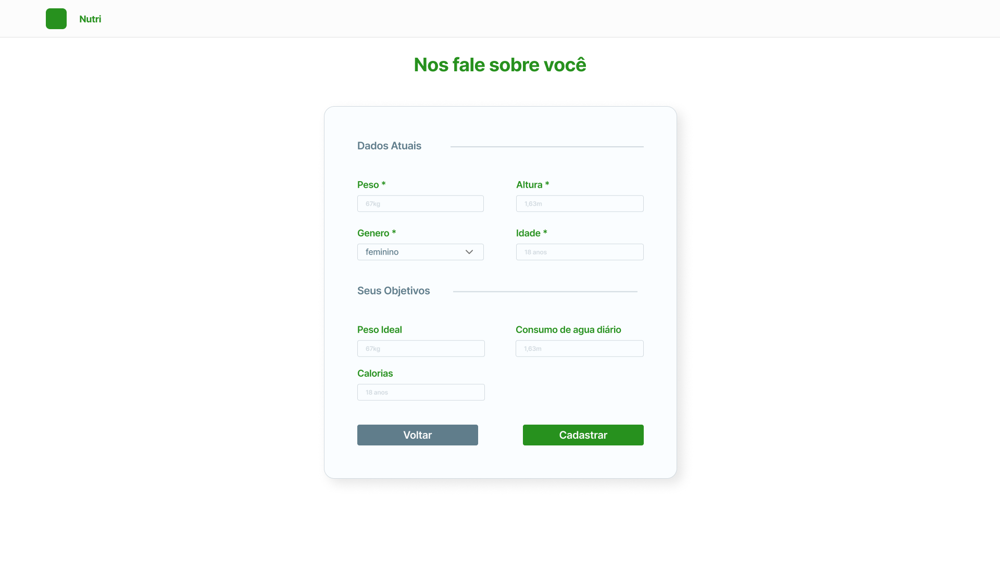

#### Princípios Gestálticos
* **Proximidade:** Campos são agrupados em duas seções principais — “Dados Atuais” e “Seus Objetivos” — facilitando a compreensão de propósito de cada grupo.
* **Semelhança:** Campos e rótulos seguem o mesmo estilo e alinhamento, reforçando a coesão visual.
* **Continuidade:** O alinhamento em duas colunas mantém uma leitura fluida da esquerda para a direita e de cima para baixo.
* **Figura-fundo:** Assim como na tela anterior, a caixa branca sob o fundo cinza-claro cria contraste que destaca o conteúdo relevante.
* **Fechamento:** As linhas horizontais que separam as seções criam uma sensação de agrupamento completo e bem estruturado.

#### Regras de Ouro da Interação
* **Consistência:** Mantém o mesmo padrão visual e de interação da tela anterior — reforçando a continuidade entre etapas.
* **Feedback:** Os botões “Voltar” (cinza) e “Cadastrar” (verde) sinalizam ações distintas, com cores reforçando a hierarquia das ações.
* **Minimizar carga de memória:** Labels e placeholders são autoexplicativos, reduzindo a necessidade de o usuário lembrar formatos de dados.
* **Controle e liberdade:** O botão “Voltar” permite correção sem perda de progresso, aumentando o sentimento de controle.
* **Prevenção de erros:** Campos obrigatórios estão marcados com asterisco, orientando claramente o preenchimento.

#### Recomendações Ergonômicas
* **Agrupamento e distinção:** As seções separadas por linhas reforçam a estrutura e reduzem confusões entre informações pessoais e objetivos.
* **Legibilidade:** Tipografia em verde e cinza escuro proporciona contraste adequado e leitura confortável.
* **Compatibilidade com o usuário:** Linguagem simples e foco em dados familiares (peso, altura, idade).
* **Minimização da carga de trabalho:** Apenas informações essenciais são solicitadas; entradas curtas e diretas.
* **Acessibilidade e usabilidade:** Campos amplos e bem espaçados facilitam o uso em diferentes dispositivos e tamanhos de tela.

### Tela: Login

A **Meta Principal** da tela Login é **permitir que usuários já cadastrados acessem suas contas** de forma simples e direta. Ela deve **garantir autenticação segura** com e-mail e senha, mantendo a coerência visual com o restante da aplicação, e deve servir como **ponto de entrada** ao ambiente autenticado da plataforma Nutri.

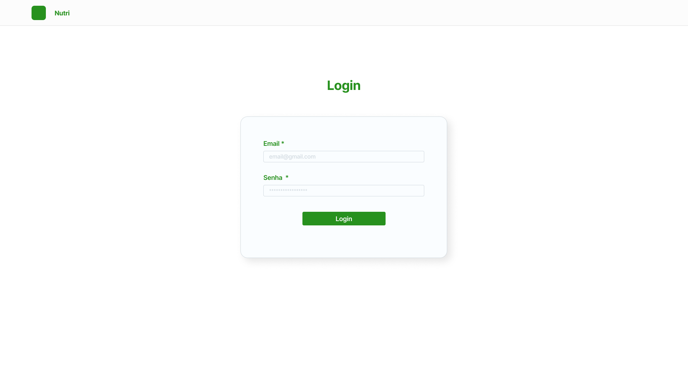

#### Princípios Gestálticos
* **Proximidade:** Campos de e-mail e senha, juntamente com o botão “Login”, estão agrupados de forma compacta e clara.
* **Semelhança:** Inputs seguem o mesmo estilo dos formulários anteriores, criando continuidade visual.
* **Continuidade:** O fluxo de interação é vertical e natural — título $\rightarrow$ campos $\rightarrow$ botão — minimizando esforço cognitivo.
* **Figura-fundo:** O formulário branco com sombra suave se destaca do fundo claro, direcionando o foco do usuário.
* **Fechamento:** A forma arredondada da caixa e seu espaçamento interno equilibrado formam um bloco de leitura coeso.

#### Regras de Ouro da Interação
* **Consistência:** Reutiliza o mesmo padrão de design e cores do cadastro, reforçando familiaridade e confiança.
* **Feedback:** O botão “Login” verde indica claramente a ação principal e comunica sucesso visual ao ser clicado.
* **Minimizar carga de memória:** Campos simples, com placeholders sugestivos (“email@gmail.com”), evitam erros e reduzem confusão.
* **Controle e liberdade:** A tela é limpa e sem distrações, focada apenas na ação essencial de entrada.
* **Prevenção de erros:** Campos obrigatórios marcados com * garantem clareza na obrigatoriedade das informações.

#### Recomendações Ergonômicas
* **Agrupamento centralizado:** O formulário está em destaque na tela, o que ajuda o usuário a se concentrar apenas na tarefa de login.
* **Legibilidade:** Título em verde e campos claros garantem contraste e leitura rápida.
* **Compatibilidade:** Layout familiar, semelhante a outros sistemas de login, reduz curva de aprendizado.
* **Minimização da carga de trabalho:** Apenas dois campos, com ação direta.
* **Acessibilidade:** Campos amplos e botão com contraste adequado favorecem usabilidade em qualquer dispositivo.

### Tela: Publicações

A **Meta Principal** da tela Publicações é **exibir uma lista cronológica e organizada** dos posts criados pela profissional de saúde ("Dra. Fabiana") para seus usuários. Ela deve servir como um **painel de gerenciamento básico**, permitindo a criação, exclusão e filtragem de posts, e deve **garantir a legibilidade e a escaneabilidade** do conteúdo, priorizando o texto e as informações essenciais de cada publicação.

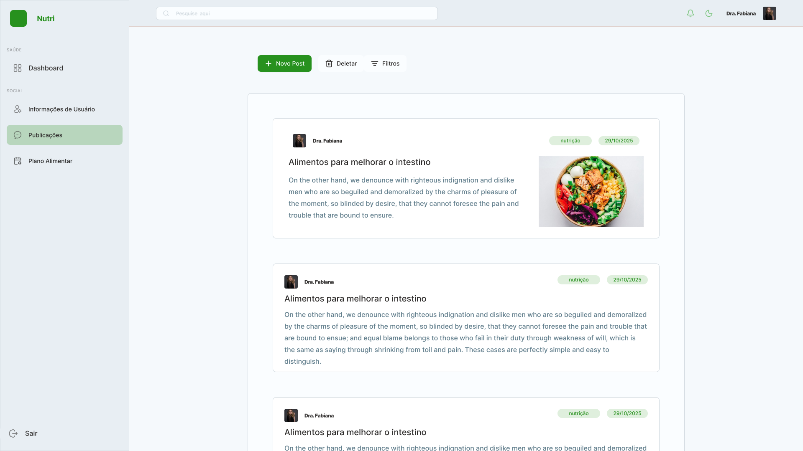

#### Princípios Gestálticos
* **Proximidade:** As informações de um único post (autor, título, categoria/data, resumo e imagem de capa) estão agrupadas em um card único.
* **Continuidade:** O layout em lista vertical facilita a rolagem e a leitura sequencial das publicações. Dentro do card, o texto flui de forma organizada antes da imagem.
* **Figura-fundo:** Os cards individuais de cada post se destacam como "figuras" sobre o fundo claro da tela.
* **Similaridade:** Todos os cards de posts mantêm o mesmo layout, tipografia e estrutura visual.

#### Regras de Ouro
* **Consistência:** O layout de navegação lateral (Sidebar) e o cabeçalho superior (Header) são mantidos, e o formato do card é repetitivo e previsível.
* **Atalhos:** O botão proeminente de "+ Novo Post" serve como um atalho claro e direto para a tarefa principal da tela.
* **Minimizar Carga de Memória:** O uso de etiquetas de categoria ("nutrição") e a data permitem a rápida identificação do conteúdo sem exigir esforço de memória.
* **Controle ao Usuário:** As opções de "Deletar" e "Filtros" dão controle explícito sobre o gerenciamento e a visualização do conteúdo.

#### Recomendações Ergonômicas
* **Agrupamento e distinção entre itens:** O uso de cards separa claramente cada publicação.
* **Minimização da carga de trabalho do usuário:** A exibição de um resumo do post diretamente no card permite que o usuário decida se quer ler o conteúdo completo sem precisar clicar.
* **Legibilidade:** O uso de uma tipografia clara e espaçamento adequado garante boa legibilidade.
* **Compatibilidade com o usuário:** Os ícones e botões de ação ("Deletar", "Filtros") usam linguagem clara e compatível com as expectativas de um gerenciador de conteúdo.

### Modal: Criar novo post

A **Meta Principal** deste modal é **focar o usuário unicamente na tarefa de criação** de um novo post, bloqueando temporariamente a interação com a tela de fundo. Deve **coletar de forma estruturada** as informações essenciais para a publicação (capa, título, categoria e corpo do texto), e **promover um fluxo de trabalho claro e direto** para a criação de conteúdo.

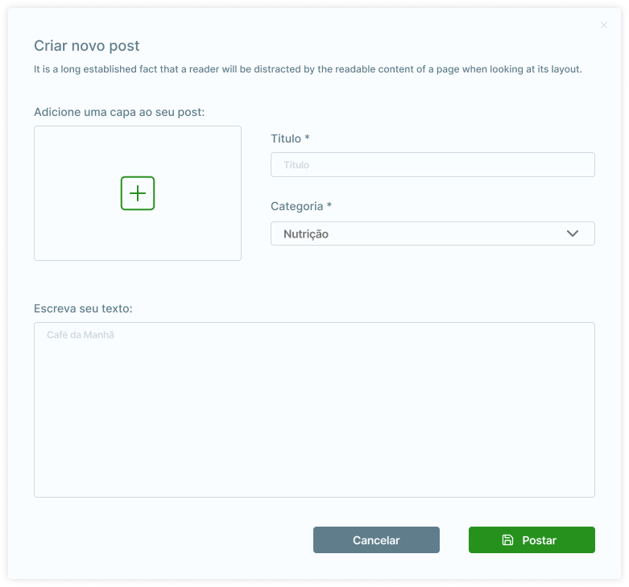

#### Princípios Gestálticos
* **Proximidade:** Os campos relacionados (Título e Categoria) estão agrupados à direita, enquanto a área de upload da capa está à esquerda. A área de texto ocupa a largura completa.
* **Fechamento:** A borda explícita do modal cria um forte senso de fechamento e foco.
* **Continuidade:** O fluxo de preenchimento segue uma ordem lógica de cima para baixo: Capa/Título/Categoria $\rightarrow$ Texto $\rightarrow$ Botões de Ação.
* **Figura-fundo:** O modal atua como a "figura" principal, garantindo a atenção máxima ao formulário.

#### Regras de Ouro
* **Consistência:** O uso de asteriscos $(*)$ para indicar campos obrigatórios (Título e Categoria) é uma convenção padrão.
* **Feedback/Ajuda:** O texto auxiliar/de placeholder (instrução clara para o usuário) é crucial para guiar o preenchimento.
* **Minimizar Carga de Memória:** O placeholder dentro do campo ("Título") ou a informação padrão no dropdown ("Nutrição") fornecem lembretes contextuais.
* **Controle ao Usuário:** O botão "Cancelar" e o ícone de fechar (x) dão controle total para o usuário desistir da ação a qualquer momento.

#### Recomendações Ergonômicas
* **Agrupamento e distinção entre itens:** O design em duas colunas (Capa vs. Título/Categoria) e a separação com a área de texto criam um agrupamento funcional.
* **Controle explícito:** Os botões "Postar" (cor verde) e "Cancelar" têm ações claras e opostas, reduzindo erros.
* **Feedback imediato:** O dropdown para "Categoria" reduz a chance de erro de digitação, fornecendo opções predefinidas.
* **Compatibilidade com o usuário:** A ordem de preenchimento dos campos segue a lógica de criação de um post (informações básicas primeiro, depois o conteúdo principal).

### Tela: Plano Alimentar

A **Meta Principal** da tela Plano Alimentar é **exibir e gerenciar a dieta/plano alimentar semanal** de um usuário de forma estruturada e quantificada (calorias, macronutrientes). Deve permitir a **navegação clara entre os dias da semana** e **facilitar a replicação e o registro rápido** de novas refeições.

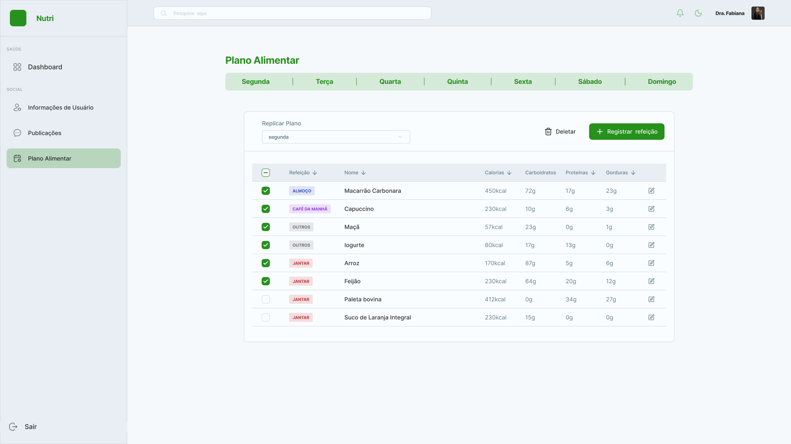

#### Princípios Gestálticos
* **Proximidade:** Dentro da tabela, as informações de uma única refeição (Nome, Calorias, Carboidratos, Proteínas, Gorduras e o ícone de edição) estão agrupadas na mesma linha.
* **Continuidade:** A estrutura de abas para os dias da semana (Segunda, Terça, Quarta...) estabelece uma linha de continuidade temporal. A tabela segue a leitura horizontal para as informações nutricionais.
* **Fechamento:** As bordas da tabela e o agrupamento visual de cada linha (refeição) criam a percepção de unidades completas de informação.
* **Semelhança:** Todas as linhas da tabela (refeições) têm a mesma formatação e os mesmos tipos de dados.

#### Regras de Ouro
* **Consistência:** O uso de ícones padronizados (setas de ordenação, ícone de lápis para edição) e a estrutura de navegação lateral (Sidebar) são consistentes. A cor verde é usada para ações positivas.
* **Minimizar Carga de Memória:** O uso de cores e etiquetas visuais (ex: ALMOÇO em azul, JANTAR em vermelho) permite ao usuário identificar rapidamente o tipo de refeição. Os cabeçalhos da tabela são claros.
* **Controle ao Usuário:** A função de "Replicar Plano" e os botões "Deletar" e "Registrar Refeição" oferecem controle completo sobre a criação e alteração da dieta.
* **Feedback:** O uso de ícones de checkbox verdes indica quais itens estão inclusos no plano atual ou qual foi o estado da última ação.

#### Recomendações Ergonômicas
* **Agrupamento e distinção entre itens:** O uso de uma tabela é a forma mais ergonômica de apresentar dados quantificados e compará-los facilmente.
* **Consistência:** O sistema de abas para dias da semana é um padrão de design conhecido e fácil de usar.
* **Minimização da carga de trabalho do usuário:** A opção de "Replicar Plano" reduz drasticamente o esforço de preenchimento.
* **Legibilidade:** A separação das colunas e o alinhamento de números facilitam a leitura rápida dos valores nutricionais.

### Informações do Usuário

A **Meta Principal** da tela de Informações do Usuário/Perfil é permitir a **visualização e edição dos dados cadastrais** (como peso, altura, gênero e idade) e das **metas nutricionais** (incluindo peso ideal, consumo de água e calorias) da nutricionista ou do usuário que ela está gerenciando. A tela deve **agrupar de forma clara** os dados atuais e os objetivos futuros, e fornecer **controle explícito** ao usuário para salvar, descartar alterações ou gerenciar sua conta.

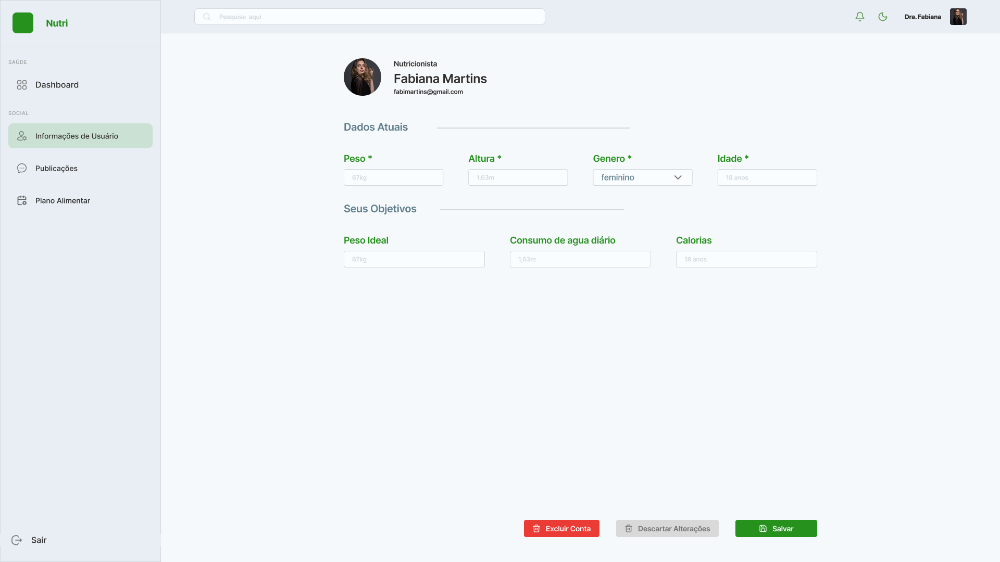

#### Princípios Gestálticos
* **Proximidade:**
    * Os campos de *Dados Atuais* (Peso, Altura, Gênero, Idade) estão agrupados na linha superior, indicando status quo.
    * Os campos de *Seus Objetivos* (Peso Ideal, Consumo de água diário, Calorias) estão agrupados na linha inferior, indicando metas futuras.
* **Continuidade:** O layout segue uma progressão clara: Identificação (topo) $\rightarrow$ Dados Atuais $\rightarrow$ Objetivos $\rightarrow$ Ações de Gerenciamento (rodapé).
* **Semelhança:** Todos os campos de input e dropdowns (seleção) compartilham o mesmo estilo visual, reforçando a unidade do formulário.
* **Figura-fundo:** O perfil e os formulários de dados formam a "figura" principal sobre o fundo claro, garantindo foco.

#### Regras de Ouro
* **Consistência:** A navegação lateral (Sidebar) e o cabeçalho são mantidos. Campos obrigatórios são marcados com asteriscos $(*)$.
* **Atalhos (Eficiência):** A divisão dos campos em duas linhas distintas e o alinhamento claro facilitam a varredura e o preenchimento rápido.
* **Minimizar Carga de Memória:** Os títulos claros das seções ("Dados Atuais", "Seus Objetivos") e dos campos reduzem a necessidade de interpretação e memorização.
* **Controle ao Usuário:** A tela oferece botões de ação cruciais e diferenciados: "Salvar" (verde, primária), "Descartar Alterações" (cinza, secundária) e "Excluir Conta" (vermelho, perigosa), dando controle total sobre os dados.

#### Recomendações Ergonômicas
* **Agrupamento e distinção entre itens:** O uso de títulos de seção é fundamental para distinguir o propósito dos grupos de campos.
* **Controle explícito:** As ações no rodapé são claras e diferenciadas por cor, seguindo a convenção de cores (verde para salvar, vermelho para excluir).
* **Minimização da carga de trabalho do usuário:** O uso de um dropdown para Gênero simplifica o preenchimento e padroniza a entrada de dados.
* **Legibilidade:** Tipografia clara e espaçamento adequado garantem que todas as informações e labels sejam facilmente legíveis.

### Modal: Adicionar Item

A **Meta Principal** do modal é **confirmar e refinar a adição** de um item (alimento ou receita) a uma refeição específica no diário alimentar. Ele permite que o usuário **ajuste a quantidade** e **defina a categoria de refeição** (Café da Manhã, Almoço, etc.), enquanto **exibe um resumo nutricional** do item para confirmação antes da adição.

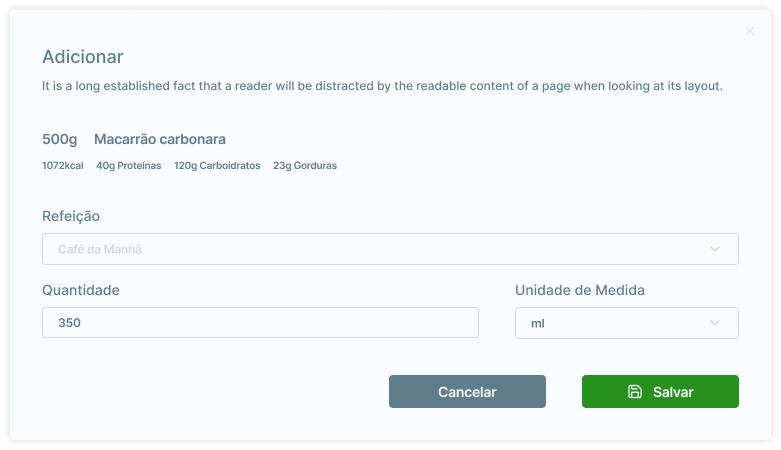

#### Princípios Gestálticos
* **Proximidade:** O resumo do item (nome, quantidade e dados nutricionais) está agrupado no topo. Os campos de ação (Refeição, Quantidade, Unidade de Medida) estão agrupados em um bloco abaixo, indicando as configurações a serem definidas.
* **Continuidade:** O fluxo é vertical: Visualizar/Confirmar Item $\rightarrow$ Definir Refeição $\rightarrow$ Definir Quantidade $\rightarrow$ Salvar.
* **Fechamento:** O modal cria um forte senso de foco na tarefa de adição.

#### Regras de Ouro
* **Feedback Imediato:** O bloco de informações no topo (ex: 500g Macarrão carbonara, 1072kcal...) é um feedback essencial, garantindo que o usuário está adicionando o item correto e sabendo seu impacto nutricional.
* **Minimizar Carga de Memória:** O dropdown para seleção da Refeição evita que o usuário tenha que digitar a categoria, reduzindo o erro e a carga de memória.
* **Consistência:** O uso dos botões "Cancelar" e "Salvar" e a tipografia seguem o padrão do sistema.

#### Recomendações Ergonômicas
* **Agrupamento e distinção entre itens:** A separação entre o resumo do item (topo) e os campos de configuração (baixo) é clara e funcional.
* **Controle explícito:** O dropdown de Refeição e o campo de Quantidade permitem um ajuste fino da entrada antes da ação final.
* **Compatibilidade com o usuário:** O processo simula a experiência real: "Tenho o item X. Qual refeição é? Qual a quantidade que comi?"

### Modal: Editar Item

A **Meta Principal** deste modal é **permitir a modificação** dos dados de um item já registrado no diário alimentar. Os parâmetros editáveis são a **categoria da refeição** e a **quantidade/unidade** do item consumido, mantendo o **feedback nutricional visível** durante o processo de edição.

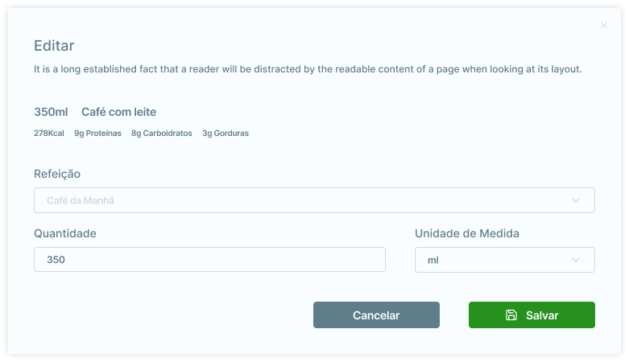

#### Princípios Gestálticos
* **Proximidade:** Similar ao modal "Adicionar Item", o bloco de informações existentes (ex: 350ml Café com leite, 278kcal) está agrupado e separado dos campos de edição.
* **Continuidade:** O fluxo é idêntico ao de adição, pois as ações são as mesmas (selecionar refeição e definir quantidade), mas no contexto de modificação.
* **Semelhança:** A estrutura do modal é muito semelhante à de "Adicionar Item", o que é uma aplicação do princípio da Consistência, reduzindo a curva de aprendizado.

#### Regras de Ouro
* **Feedback Contínuo:** O resumo do item, pré-populado com os dados atuais, serve como ponto de partida para a edição.
* **Consistência (Shneiderman):** A similaridade com o modal de adição garante que o usuário que já aprendeu a adicionar um item, saberá como editá-lo.
* **Controle ao Usuário:** A capacidade de editar a categoria da Refeição e a Quantidade dá ao usuário controle total para corrigir erros no registro.

#### Recomendações Ergonômicas
* **Agrupamento e distinção entre itens:** A separação visual entre os dados nutricionais e os campos de edição impede que o usuário tente editar as calorias diretamente.
* **Minimização da carga de trabalho do usuário:** Ao pré-popular os campos de Refeição e Quantidade com os valores atuais, o usuário só precisa interagir com o campo que deseja modificar.
* **Legibilidade:** O uso de negrito e bom contraste no resumo do item facilita a leitura das informações antes da edição.

### Tela: Principal / Dashboard

A **Meta Principal** da tela Principal/Dashboard é atuar como o painel de controle central, fornecendo ao usuário uma **visão geral imediata** de seu progresso diário em métricas como calorias, água e macronutrientes. Além disso, deve **exibir o diário alimentar detalhado** do dia atual e **oferecer sugestões rápidas** de refeições ou receitas para facilitar o registro de novos itens.

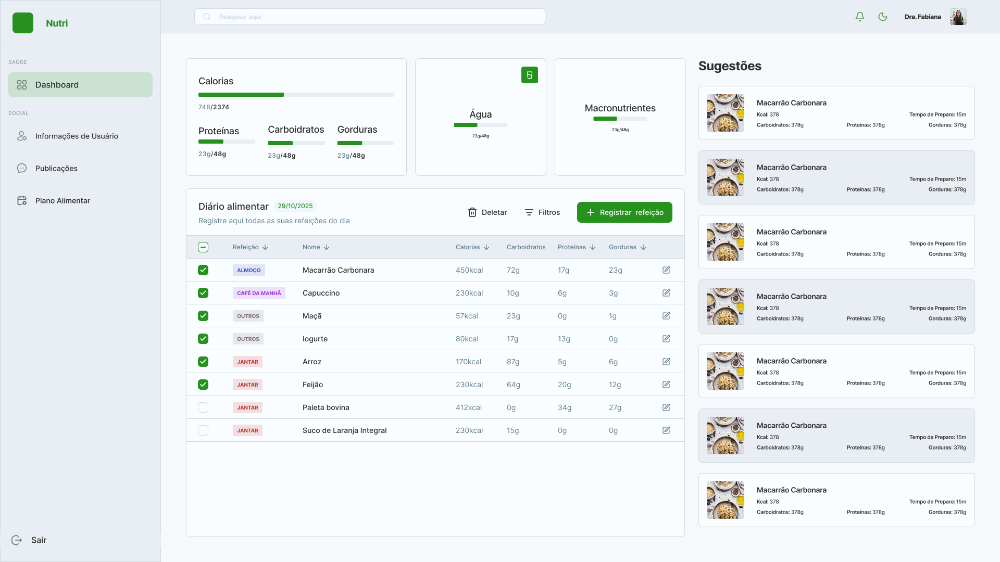

#### Princípios Gestálticos
* **Proximidade:** Os cards de métricas (Calorias, Água, Macronutrientes) estão agrupados no topo como o bloco de "Status Diário". O Diário Alimentar e as Sugestões estão dispostos lado a lado.
* **Continuidade:** O layout da tela é dividido claramente em linhas: Métricas (topo), Diário Alimentar (coluna principal) e Sugestões (coluna lateral), guiando o olhar do usuário.
* **Semelhança:** As "Sugestões" usam cards com a mesma estética visual. As linhas do "Diário Alimentar" são idênticas.
* **Figura-fundo:** Os painéis brancos do Dashboard (Métricas, Diário, Sugestões) se destacam como "figuras" sobre o fundo claro da tela.

#### Regras de Ouro
* **Feedback Contínuo:** As barras de progresso fornecem feedback visual imediato sobre o cumprimento das metas diárias.
* **Minimizar Carga de Memória:** O diário alimentar exibe todas as refeições e seus valores nutricionais em uma única tabela.
* **Consistência:** A navegação lateral (Sidebar) é mantida. O uso de cores para ações e categorização de refeições é consistente.
* **Controle ao Usuário:** Botões claros como "+ Registrar Refeição" e opções de filtro e edição na tabela dão controle total sobre o diário.

#### Recomendações Ergonômicas
* **Agrupamento e distinção entre itens:** O uso de cards separados para métricas separa visualmente as diferentes informações.
* **Compatibilidade com o usuário:** O layout espelha a forma como as pessoas pensam sobre a dieta: metas (topo) e registro detalhado (tabela).
* **Alta Usabilidade (Princípio de Fitt's Law):** O botão "+ Registrar Refeição" é grande e de cor contrastante, tornando-o um alvo fácil e prioritário.
* **Legibilidade:** A tabela do diário alimentar permite a leitura e comparação rápida dos dados nutricionais.

### Modal: Registrar refeição

A **Meta Principal** do modal é permitir a **construção de uma refeição composta** por um ou mais itens (alimentos ou receitas) de forma ágil. Deve integrar funções de **busca, registro de quantidade** e a **exibição de um resumo nutricional em tempo real** da refeição que está sendo montada.

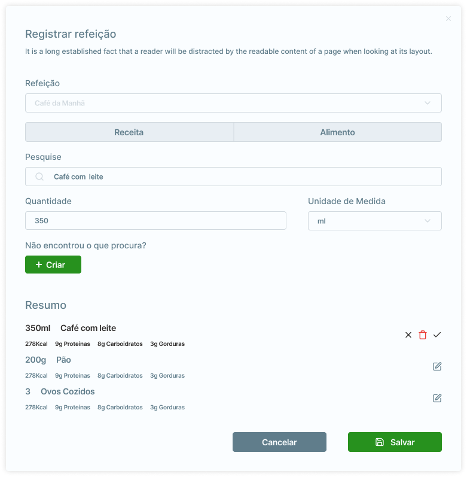

#### Princípios Gestálticos
* **Proximidade:** Os campos de "Pesquisa", "Quantidade" e "Unidade de Medida" estão agrupados para a ação de "adicionar um item". O "Resumo" é separado visualmente.
* **Continuidade:** O fluxo é lógico: Selecionar o tipo de Refeição $\rightarrow$ Escolher entre Receita/Alimento $\rightarrow$ Pesquisar e adicionar itens $\rightarrow$ Revisar o resumo.
* **Semelhança:** Todos os itens no "Resumo" possuem o mesmo estilo de exibição de dados nutricionais.
* **Fechamento:** O contorno do modal e os separadores visuais organizam a interface em blocos funcionais.

#### Regras de Ouro
* **Controle ao Usuário:** O usuário pode escolher entre adicionar uma "Receita" ou um "Alimento" e pode editar ou deletar itens diretamente no resumo.
* **Feedback Imediato:** A seção "Resumo" atua como feedback em tempo real sobre o impacto calórico e nutricional dos itens adicionados.
* **Consistência:** O uso de botões "Cancelar" e "Salvar" e o ícone de fechar (x) seguem o padrão de modais do sistema.
* **Flexibilidade (Princípio da Diferenciação):** A opção "+ Criar" oferece um caminho alternativo para o usuário que não encontrar o item na base de dados.

#### Recomendações Ergonômicas
* **Agrupamento e distinção entre itens:** O uso de abas para "Receita" e "Alimento" segmenta a busca, reduzindo a complexidade.
* **Minimização da carga de trabalho do usuário:** A função de "Pesquisa" reduz o esforço de encontrar e digitar os dados nutricionais manualmente.
* **Controle explícito:** Os ícones de exclusão (lixeira) e de confirmação/seleção (check) na linha de cada item no resumo são claros e fáceis de usar.

### Modal: Registrar Receita

A **Meta Principal** deste modal é permitir que o usuário ou nutricionista **crie uma nova receita personalizada** no sistema. A receita é definida pela **soma de seus componentes (alimentos)** e suas respectivas quantidades, gerando um **valor nutricional total**.

#### Princípios Gestálticos
* **Proximidade:** O campo de "Nome da Receita" é separado do bloco de "Adicionar Alimentos", indicando as duas etapas principais: nomear e compor.
* **Continuidade:** O fluxo segue uma progressão vertical lógica: Nome $\rightarrow$ Composição dos Alimentos $\rightarrow$ Resumo $\rightarrow$ Ação de Salvar.
* **Fechamento:** O resumo dos alimentos é claramente demarcado, criando uma lista coesa dos ingredientes que compõem a receita.

#### Regras de Ouro
* **Consistência:** O modal mantém a mesma estrutura de formulário e botões de ação do modal de "Registrar Refeição", garantindo previsibilidade.
* **Controle ao Usuário:** O usuário tem controle total sobre o nome da receita (campo livre) e a composição (pesquisa, quantidade, edição/exclusão no resumo).
* **Feedback Imediato:** O "Resumo" mostra os alimentos adicionados e seus valores nutricionais, permitindo ao usuário verificar a composição nutricional da receita em construção.

#### Recomendações Ergonômicas
* **Agrupamento e distinção entre itens:** O uso da aba fixa "Alimentos" reforça que uma receita é composta por alimentos individuais.
* **Minimização da carga de trabalho do usuário:** A interface de pesquisa de alimentos com campos de quantidade e unidade é direta, focando na tarefa de adicionar ingredientes de forma eficiente.
* **Legibilidade:** O resumo dos ingredientes em formato de lista com valores nutricionais abaixo de cada item é altamente legível.

### Modal: Registrar Alimento

A **Meta Principal** deste modal é oferecer um **caminho rápido e manual** para que o usuário ou nutricionista **insira um novo alimento** na base de dados. Deve coletar o nome do alimento e, crucialmente, seus **valores de macronutrientes** (Proteínas, Carboidratos, Gordura).

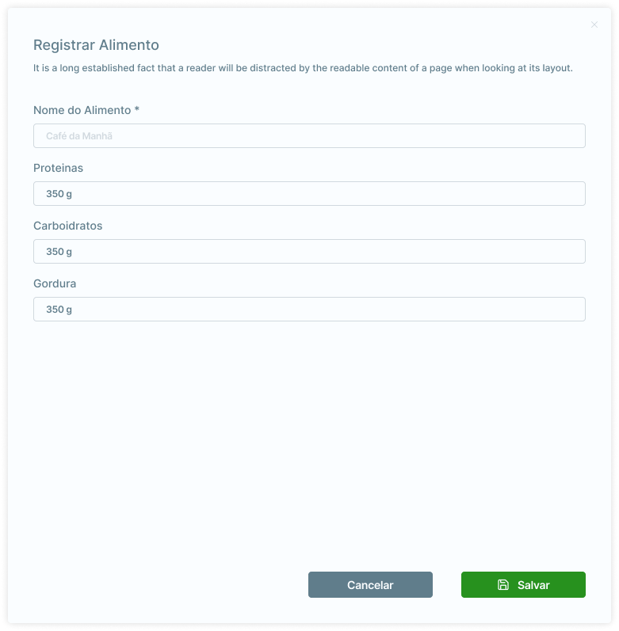

#### Princípios Gestálticos
* **Proximidade:** Todos os campos de input ("Nome do Alimento", "Proteínas", "Carboidratos", "Gordura") estão alinhados e próximos, indicando que formam um único formulário de cadastro.
* **Continuidade:** O fluxo de preenchimento é linear e segue a ordem de informação: Nome (identificação) $\rightarrow$ Proteínas $\rightarrow$ Carboidratos $\rightarrow$ Gordura (dados nutricionais).
* **Fechamento:** O modal focado garante que o usuário se concentre na tarefa única de preencher esses quatro campos essenciais.

#### Regras de Ouro
* **Consistência:** Mantém o uso do asterisco $(*)$ para campo obrigatório e o padrão de botões e modal.
* **Minimizar Carga de Memória:** O formulário é extremamente enxuto (apenas 4 campos principais), exigindo o mínimo de esforço cognitivo. Os placeholders sugerem o formato esperado.
* **Controle ao Usuário:** O botão "Salvar" conclui o processo e "Cancelar" permite o abandono da ação.

#### Recomendações Ergonômicas
* **Agrupamento e distinção entre itens:** O alinhamento simples e vertical dos campos é o mais ergonômico para um formulário de cadastro rápido.
* **Minimização da carga de trabalho do usuário:** A simplificação do formulário apenas para os macronutrientes essenciais otimiza a tarefa.
* **Controle explícito:** As etiquetas de campo são claras e usam terminologia nutricional padrão.

## 4.4 Testes com Protótipos

Teste 01: Entrevista de prótótipo, mulher, 31 anos.

1. Ao acessar a página inicial, você conseguiu entender rapidamente qual é o propósito ou objetivo principal do site?
R: Consigo, mas depois de alguns momentos
2. O menu e os botões estavam posicionados de forma intuitiva?
R: Achei que sim
3. A nomenclatura das seções (menus, botões, links) fez sentido para você?
R: Sim
4. Você conseguiu encontrar facilmente as seções ou informações que procurava no protótipo?
R: Achei
5. As etapas apresentadas para realizar as tarefas estavam claras e seguiam uma lógica compreensível?
R: Sim
6. Os elementos visuais (cores, ícones e disposição dos botões) facilitaram a identificação do que era clicável e do que era apenas informativo?
R: Sim
7. Há elementos visuais que chamam atenção indevidamente ou confundem?
R: Não
8. Encontrou termos técnicos ou expressões confusas?
R: Não
9. Você se sentiu confiante e satisfeito ao interagir com o protótipo, sem necessidade de ajuda externa?
R: Sim, achei bem intuitivo
10. Você sentiu alguma dificuldade no processo de registrar alimentos?
R: Não, a pesquisa está bastante clara
11. As informações sobre progresso pessoal estavam claras e fáceis de entender?
R: Sim
12. Você acha que o site realmente ajudaria alguém a manter uma alimentação saudável? 
R: Sim, me ajudaria com certeza
13. O que você mudaria ou melhoraria?
R: Acho que páginas um pouco mais informativas
14. Tem algo mais que gostaria de comentar sobre os protótipos?
R: Não, no geral, gostei muito

Teste 02: Entrevista de protótipo, homem, 29 anos.

1. Ao acessar a página inicial, você conseguiu entender rapidamente qual é o propósito ou objetivo principal do site?
R: Um pouco
2. O menu e os botões estavam posicionados de forma intuitiva?
R: Sim
3. A nomenclatura das seções (menus, botões, links) fez sentido para você?
R: Sim
4. Você conseguiu encontrar facilmente as seções ou informações que procurava no protótipo?
R: sim
5. As etapas apresentadas para realizar as tarefas estavam claras e seguiam uma lógica compreensível?
R: Sim
6. Os elementos visuais (cores, ícones e disposição dos botões) facilitaram a identificação do que era clicável e do que era apenas informativo?
R: Sim
7. Há elementos visuais que chamam atenção indevidamente ou confundem?
R: Não
8. Encontrou termos técnicos ou expressões confusas?
R: Não
9. Você se sentiu confiante e satisfeito ao interagir com o protótipo, sem necessidade de ajuda externa?
R: Sim
10. Você sentiu alguma dificuldade no processo de registrar alimentos?
R: Não senti dificuldades
11. As informações sobre progresso pessoal estavam claras e fáceis de entender?
R: Sim
12. Você acha que o site realmente ajudaria alguém a manter uma alimentação saudável? 
R: Acredito que sim
13. O que você mudaria ou melhoraria?
R: Senti falta de um resumo das funções do site
14. Tem algo mais que gostaria de comentar sobre os protótipos?
R: Não, achei o site muito bom

Teste 03: Entrevista de protótipo, homem, 18 anos.

1. Ao acessar a página inicial, você conseguiu entender rapidamente qual é o propósito ou objetivo principal do site?
R: Poderia ser mais claro
2. O menu e os botões estavam posicionados de forma intuitiva?
R: Sim
3. A nomenclatura das seções (menus, botões, links) fez sentido para você?
R: Sim
4. Você conseguiu encontrar facilmente as seções ou informações que procurava no protótipo?
R: sim
5. As etapas apresentadas para realizar as tarefas estavam claras e seguiam uma lógica compreensível?
R: Mais ou menos, algumas etapas(cadastrado de refeição) fiquei em duvida
6. Os elementos visuais (cores, ícones e disposição dos botões) facilitaram a identificação do que era clicável e do que era apenas informativo?
R: Sim
7. Há elementos visuais que chamam atenção indevidamente ou confundem?
R: Não
8. Encontrou termos técnicos ou expressões confusas?
R: Não
9. Você se sentiu confiante e satisfeito ao interagir com o protótipo, sem necessidade de ajuda externa?
R: Sim
10. Você sentiu alguma dificuldade no processo de registrar alimentos?
R: Um pouco
11. As informações sobre progresso pessoal estavam claras e fáceis de entender?
R: Sim
12. Você acha que o site realmente ajudaria alguém a manter uma alimentação saudável? 
R: Acredito que sim
13. O que você mudaria ou melhoraria?
R: Acompanhamento da agua poderia ser mais facil
14. Tem algo mais que gostaria de comentar sobre os protótipos?
R: Não

Teste 04: Entrevista de protótipo, mulher, 22 anos

1. Ao acessar a página inicial, você conseguiu entender rapidamente qual é o propósito ou objetivo principal do site?  
R: Sim, mas poderia estar um pouco mais claro.
2. O menu e os botões estavam posicionados de forma intuitiva?  
R: Na maioria das vezes sim, mas alguns ícones geraram dúvida.
3. A nomenclatura das seções (menus, botões, links) fez sentido para você? 
R: Sim.
4. Você conseguiu encontrar facilmente as seções ou informações que procurava no protótipo?  
R: Sim, só precisei olhar duas vezes em algumas partes.
5. As etapas apresentadas para realizar as tarefas estavam claras e seguiam uma lógica compreensível? 
R: Em geral sim, mas o cadastro de alimentos ficou um pouco confuso.
6. Os elementos visuais (cores, ícones e disposição dos botões) facilitaram a identificação do que era clicável e do que era apenas informativo? 
R: Sim.
7. Há elementos visuais que chamam atenção indevidamente ou confundem?
R: Um pouco, principalmente nas cores das seções.
8. Encontrou termos técnicos ou expressões confusas?**  
R: Não.
9. Você se sentiu confiante e satisfeito ao interagir com o protótipo, sem necessidade de ajuda externa? 
R: Sim.
10. Você sentiu alguma dificuldade no processo de registrar alimentos?
R: Um pouco, parecia ter etapas demais.
11. As informações sobre progresso pessoal estavam claras e fáceis de entender?
R: Sim.
12. Você acha que o site realmente ajudaria alguém a manter uma alimentação saudável?
13. R: Sim, acho que pode ser bem útil.
14. O que você mudaria ou melhoraria?  
R: não.
15. Tem algo mais que gostaria de comentar sobre os protótipos?  
R: Gostei do visual, mas acho que poderia ser mais dinâmico.

Teste 05: Entrevista de protótipo, mulher, 54 anos

1. Ao acessar a página inicial, você conseguiu entender rapidamente qual é o propósito ou objetivo principal do site?  
   R: Sim, ficou bem claro que é um site sobre alimentação e controle nutricional.
2. O menu e os botões estavam posicionados de forma intuitiva?  
   R: Sim, a navegação é fácil, mas alguns botões poderiam ser maiores.
3. A nomenclatura das seções (menus, botões, links) fez sentido para você?  
   R: Sim, são nomes diretos e fáceis de entender.
4. Você conseguiu encontrar facilmente as seções ou informações que procurava no protótipo?  
   R: Sim, mas achei que o progresso pessoal poderia estar mais visível.
5. As etapas apresentadas para realizar as tarefas estavam claras e seguiam uma lógica compreensível?  
   R: Sim, mas o cadastro de refeição demorou um pouco pra entender.
6. Os elementos visuais (cores, ícones e disposição dos botões) facilitaram a identificação do que era clicável e do que era apenas informativo?  
   R: Na maioria das vezes sim, mas algumas áreas ficaram muito parecidas.
7. Há elementos visuais que chamam atenção indevidamente ou confundem?  
   R: Sim, alguns textos coloridos chamam mais atenção que os botões.
8. Encontrou termos técnicos ou expressões confusas?  
   R: Não, a linguagem está simples.
9. Você se sentiu confiante e satisfeito ao interagir com o protótipo, sem necessidade de ajuda externa?  
   R: Sim, o uso é tranquilo.
10. Você sentiu alguma dificuldade no processo de registrar alimentos?  
    R: Um pouco, achei que faltavam exemplos de porções.
11. As informações sobre progresso pessoal estavam claras e fáceis de entender?  
    R: Sim, mas poderiam ter gráficos pra facilitar a visualização.
12. Você acha que o site realmente ajudaria alguém a manter uma alimentação saudável?  
    R: Sim, ajuda a ter controle melhor, mas precisa de mais lembretes ou alertas.
13. O que você mudaria ou melhoraria?  
    R: Melhoraria o destaque do botão de salvar e adicionaria gráficos no painel principal.
14. Tem algo mais que gostaria de comentar sobre os protótipos?  
    R: Gostei da ideia geral, mas ainda parece um pouco simples visualmente.

Nesta seção você deve apresentar os testes realizados com usuários utilizando os protótipos de alta fidelidade desenvolvidos na seção anterior. O objetivo é avaliar a usabilidade, a clareza das informações e a adequação do design às necessidades das personas definidas no projeto.

Cada integrante do grupo deverá aplicar o teste com um usuário distinto, preferencialmente alinhado ao perfil das personas criadas. Devem ser definidas previamente as tarefas que o usuário deverá executar no protótipo (por exemplo: realizar um cadastro, buscar um produto, concluir uma compra).

Durante a aplicação do teste, registre observações sobre comportamentos, dúvidas, erros e comentários feitos pelo usuário, bem como o tempo necessário para a execução de cada tarefa. Ao final, colete o feedback do participante, destacando pontos positivos e aspectos a serem melhorados.

Os resultados obtidos por todos os integrantes devem ser consolidados, apresentando uma análise geral com os principais problemas encontrados, oportunidades de melhoria e as ações previstas para o projeto final. 
