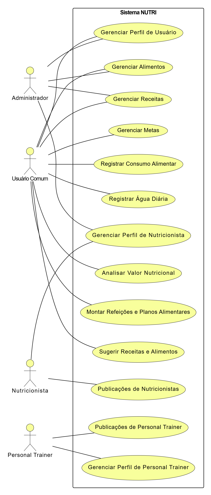

# 3. DOCUMENTO DE ESPECIFICAÇÃO DE REQUISITOS DE SOFTWARE

## 3.1 Objetivos deste documento
Descrever e especificar as necessidades dos usuários que buscam uma alimentação equilibrada e controle de indicadores de saúde, que devem ser atendidas pela aplicação web NUTRI.

## 3.2 Escopo do produto

### 3.2.1 Nome do produto e seus componentes principais
O produto será denominado NUTRI. Ele será uma aplicação web composta pelos seguintes módulos principais:

Módulo de Gestão de Alimentos e Receitas: Para cadastro e consulta de ingredientes e receitas.

Módulo de Análise Nutricional e Metabólica: Para avaliação de refeições e dietas, com foco em macronutrientes, micronutrientes e impacto glicêmico.

Módulo de Planejamento e Acompanhamento: Para montagem de planos alimentares e registro de indicadores de saúde.

Módulo de Perfil do Usuário: Para gestão de dados pessoais, metas e preferências.

### 3.2.2 Missão do produto
Capacitar os usuários a gerenciar proativamente sua saúde nutricional, permitindo o cadastro, análise e acompanhamento de receitas, refeições e dietas. A missão é traduzir conhecimento científico sobre o impacto metabólico dos alimentos (como a resposta glicêmica e de insulina) em uma ferramenta prática e acessível para o dia a dia, promovendo decisões alimentares informadas.

### 3.2.3 Limites do produto
O NUTRI não substitui a orientação de um profissional de saúde e não realiza prescrições dietéticas. O sistema não fará integração direta com dispositivos de monitoramento de saúde (como monitores contínuos de glicose), não incluirá funcionalidades de e-commerce para compra de ingredientes, nem servirá como plataforma de teleconsulta com nutricionistas.

### 3.2.4 Benefícios do produto

| # | Benefício | Valor para o Cliente |
|--------------------|------------------------------------|----------------------------------------|
|1	| Tomada de Decisão Alimentar Informada |	Essencial |
|2 | Facilidade no Controle da Saúde Metabólica (glicemia, colesterol, etc.) | Essencial | 
|3 | Aplicação Prática da Ciência Nutricional no Dia a Dia | Essencial | 
|4	| Acesso a Receitas Personalizadas e Saudáveis	| Recomendável | 

## 3.3 Descrição geral do produto

### 3.3.1 Requisitos Funcionais

| Código | Requisito Funcional (Funcionalidade) | Descrição |
|--------------------|------------------------------------|----------------------------------------|
| RF1 | Gerenciar Perfil de Usuário |	Permitir o cadastro, alteração, consulta e exclusão do perfil do usuário, incluindo dados pessoais e restrições alimentares. |
| RF2 |	Gerenciar Alimentos	| 	Permitir a consulta de alimentos em uma base de dados nutricional e o cadastro de novos alimentos pelo usuário. |
| RF3	| Gerenciar Receitas |	Permitir que o usuário cadastre, altere, exclua e busque receitas, compondo-as a partir de uma lista de ingredientes e quantidades. |
| RF4 |	Analisar Valor Nutricional	| Calcular e exibir o valor nutricional (calorias, macronutrientes, fibras, vitaminas, etc.) de alimentos, receitas, refeições e planos alimentares. |
| RF5 |	Montar Refeições e Planos Alimentares	| Permitir que o usuário crie refeições (ex: Café da Manhã, Almoço) e planos alimentares diários ou semanais, combinando receitas e alimentos. |
| RF6 |	Sugerir Receitas e Alimentos	| Oferecer sugestões de receitas e alimentos com base nas metas, preferências e restrições do usuário, e também com base nos ingredientes que ele possui. |
| RF7 |	Gerenciar Metas 	| Permitir que o usuário cadastre metas referentes a alimentação, controle de glicemia, nutrição e peso. |
| RF8 |	Registrar Consumo Alimentar	| Permitir que o usuário registre os alimentos consumidos em cada refeição ao longo do dia, possibilitando o acompanhamento e registro da alimentação. |
| RF9 |	Registrar Água Diária	| Permitir que o usuário registre a quantidade de água ingerida ao longo do dia, permitindo o acompanhamento da quantidade. |
| RF10 | Gerenciar Perfil de Nutricionista |	Permitir o cadastro, alteração e exclusão do perfil de nutricionista no sistema. |
| RF11 | Publicações de Nutricionistas |	Permitir a publicação de informações por profissionais da área sobre receitas cadastradas e orientações sobre consumo de alimentosno sistema. |
| RF12 | Publicações de Personal Trainer |	Permitir a publicação de informações por profissionais da área sobre exercícios físicos e execução dos exercícios. |
| RF13 | Gerenciar Perfil de Personal Trainer |	Permitir o cadastro, alteração e exclusão do perfil de personal trainer no sistema. |

### 3.3.2 Requisitos Não Funcionais

| Código | Requisito Não Funcional (Restrição) |
|--------------------|------------------------------------|
| RNF1 | Usabilidade: A interface do sistema deve ser intuitiva, acessível e responsiva, adaptando-se a diferentes tamanhos de tela (desktops, tablets e celulares). |
| RNF2 | Desempenho: O tempo de resposta para buscas e cálculos nutricionais não deve exceder 10 segundos, garantindo uma experiência de usuário fluida. |
| RNF3 | Confiabilidade da Base de Dados: A base de dados de alimentos deve utilizar fontes nutricionais reconhecidas e confiáveis (ex: Tabela TACO, USDA) ou APIs validadas para garantir a precisão das informações. |
| RNF4 | Segurança:O sistema deve adotar protocolos de segurança, como HTTPS e criptografia de dados sensíveis,
 para proteger as informações dos usuários. |
| RNF5 | Escalabilidade: A arquitetura do sistema deve permitir crescimento futuro, suportando aumento no número de usuários simultâneos e de dados sem perda significativa de desempenho.. |
| RNF6| Conformidade com a LGPD: O sistema deve garantir o tratamento adequado de dados pessoais dos usuários, incluindo consentimento explícito, direito de acesso, correção e exclusão de dados, conforme as diretrizes da Lei Geral de Proteção de Dados (LGPD - Lei nº 13.709/2018). |

### 3.3.3 Usuários 

| Ator | Descrição |
|--------------------|------------------------------------|
| Administrador |	Usuário gerente do sistema responsável pelo cadastro e manutenção e aperfeiçoamento. Possui acesso geral ao sistema. |
| Usuário Comum |	Usuário responsável por registrar alimentos, consumo de alimentos, receitas e metas pessoais no sistema. |
| Nutricionista |	Usuário responsável por registrar receitas e alimentos e por publicar orientações para os usuários . |
| Personal Trainer |	Usuário responsável por registrar atividades físicas e orientações sobre as execuções no sistema. |
| ... |	... |	... |

## 3.4 Modelagem do Sistema

### 3.4.1 Diagrama de Casos de Uso
Como observado no diagrama de casos de uso da Figura 1, a secretária poderá gerenciar as matrículas e professores no sistema, enquanto o coordenador, além dessas funções, poderá gerenciar os cursos de aperfeiçoamento.

#### Figura 1: Diagrama de Casos de Uso do Sistema.

 
### 3.4.2 Descrições de Casos de Uso

#### Gerenciar Perfil de Usuário (CSU01)

Sumário: Usuário realiza o cadastro, alteração, consulta ou exclusão do perfil, incluindo dados pessoais e restrições alimentares.

Ator Primário: Usuário.

Pré-condições: O usuário deve estar autenticado no sistema

Fluxo Principal:

1) O Usuário acessa a funcionalidade de Gerenciar Perfil.
2) O Sistema apresenta as opções: cadastrar, alterar, consultar ou excluir perfil.
3) O Usuário escolhe a opção desejada.
4) O Sistema solicita os dados necessários (nome, e-mail, peso, restrições alimentares, tipo de perfil etc.).
5) O Usuário preenche ou confirma as informações.
6) O Sistema valida os dados.
7 Se válidos, a operação é concluída com sucesso.

---

Fluxo Alternativo (Alteração):

 a) O Usuário seleciona "Alterar".  
 b) O Sistema mostra os dados atuais. 
 c) O Usuário altera as informações. 
 d) O Sistema valida e salva as alterações. 
 
---

Fluxo Alternativo (Consulta):

 a) O Usuário seleciona "Consultar".  
 b) O Sistema mostra os dados atuais. 
 c) O Usuário visualiza as informações. 
  
---

Fluxo Alternativo (Exclusão):

 a) O Usuário seleciona "Excluir". 
 b) O Sistema solicita confirmação. 
 c) O Usuário confirma. 
 d) O Sistema remove o perfil. 

Pós-condições: O perfil foi cadastrado, alterado ou excluído.

----

#### Gerenciar Alimentos (CSU02)

Sumário: Usuário pode consultar alimentos existentes na base de dados ou cadastrar novos alimentos.

Ator Primário: Usuário.

Pré-condições: O usuário deve estar autenticado no sistema.

Fluxo Principal (Consulta):

1) O Usuário acessa a funcionalidade de Gerenciar Alimentos.
2) O Sistema exibe a lista de alimentos cadastrados.
3) O Usuário pode pesquisar por nome ou categoria.
4) O Sistema apresenta os resultados.

---

Fluxo Alternativo (Cadastro de novo alimento)

 a) O Usuário seleciona a opção "Cadastrar alimento". 
 b) O Sistema solicita nome, categoria e informações nutricionais. 
 c) O Usuário insere os dados. 
 d) O Sistema valida e salva o novo alimento. 

Pós-condições: O alimento foi consultado ou cadastrado com sucesso

---

#### Gerenciar Receitas (CSU03)

Sumário: Usuário pode cadastrar, alterar, excluir e buscar receitas, montando-as a partir de ingredientes e quantidades.

Ator Primário: Usuário.

Pré-condições: O usuário deve estar autenticado no sistema.

Fluxo Principal (Cadastro):

1) O Usuário acessa a funcionalidade de Gerenciar Receitas.
2) O Sistema apresenta as opções: cadastrar, alterar, excluir ou buscar receitas.
3) O Usuário seleciona "Cadastrar receita".
4) O Sistema solicita nome da receita e ingredientes.
5) O Usuário informa os dados.
6) O Sistema valida e salva a receita.

---

Fluxo Alternativo (Alteração):

 a) O Usuário seleciona "Alterar receita". 
 b) O Sistema exibe receitas cadastradas. 
 c) O Usuário escolhe uma receita. 
 d) O Usuário edita dados (nome ou ingredientes). 
 e) O Sistema valida e salva alterações. 

---

Fluxo Alternativo (Exclusão):

 a) O Usuário seleciona "Excluir receita". 
 b) O Sistema lista receitas cadastradas. 
 c) O Usuário seleciona uma receita. 
 e) O Sistema solicita confirmação e exclui a receita. 

 ---

Fluxo Alternativo (Busca):

 a) O Usuário digita o nome da receita. 
 b) O Sistema exibe os resultados encontrados. 

Pós-condições: Receita cadastrada, alterada, excluída ou buscada com sucesso.

---

#### Analisar Valor Nutricional (CSU04)

Sumário: O sistema calcula e exibe o valor nutricional de alimentos, receitas, refeições e planos alimentares.

Ator Primário: Usuário.

Pré-condições: O usuário deve estar autenticado no sistema e ter alimentos/receitas cadastrados.

Fluxo Principal:

1) O Usuário acessa a funcionalidade de Analisar Valor Nutricional.
2) O Sistema solicita que o Usuário selecione um alimento, receita, refeição ou plano alimentar.
3) O Usuário seleciona a opção desejada.
4) O Sistema calcula calorias, proteínas, carboidratos, gorduras, fibras, vitaminas, etc.
5) O Sistema exibe o relatório nutricional.

---

Fluxo Alternativo (Dados insuficientes):

a) Se não houver informações nutricionais completas, o Sistema informa que não é possível calcular. 
b) Pós-condições: O valor nutricional é exibido ao usuário. 

---

### Montar Refeições e Planos Alimentares (CSU05)

**Sumário:** Usuário cria refeições diárias ou planos alimentares combinando receitas e alimentos.

**Ator Primário:** Usuário.

**Pré-condições:** O usuário deve estar autenticado e ter receitas/alimentos cadastrados.

**Fluxo Principal:**

1. O Usuário acessa a funcionalidade de Montar Refeições e Planos Alimentares.
2. O Sistema apresenta opções de criação de refeições ou planos semanais.
3. O Usuário seleciona refeições e adiciona receitas/alimentos às refeições.
4. O Sistema valida e salva o plano alimentar.

**Fluxo Alternativo (Edição de plano):**

a) O Usuário escolhe um plano existente.

b) O Sistema exibe o plano completo.

c) O Usuário adiciona ou remove refeições/receitas.

d) O Sistema valida e salva as alterações.

**Pós-condições:** Plano alimentar criado ou atualizado com sucesso.

---

### Sugerir Receitas e Alimentos (CSU06)

**Sumário:** Sistema oferece sugestões de receitas/alimentos baseadas em metas, preferências, restrições e ingredientes disponíveis.

**Ator Primário:** Usuário.

**Pré-condições:** O usuário deve estar autenticado e ter perfil e preferências cadastradas.

**Fluxo Principal:**

1. O Usuário acessa a funcionalidade de Sugestão de Receitas e Alimentos.
2. O Sistema verifica perfil, restrições e metas do usuário.
3. O Sistema apresenta sugestões de receitas/alimentos compatíveis.
4. O Usuário pode selecionar ou salvar as sugestões.

**Pós-condições:** Sugestões apresentadas e, se desejado, salvas no plano alimentar.

---

### Gerenciar Metas (CSU07)

**Sumário:** Usuário define metas alimentares, nutricionais e de saúde (glicemia, peso, etc.).

**Ator Primário:** Usuário.

**Pré-condições:** O usuário deve estar autenticado.

**Fluxo Principal:**

1. O Usuário acessa a funcionalidade de Gerenciar Metas.
2. O Sistema apresenta opções de criação, alteração ou exclusão de metas.
3. O Usuário define metas desejadas (ex: calorias diárias, ingestão de água).
4. O Sistema valida e salva as metas.

**Fluxo Alternativo (Alteração/Exclusão):**

a) O Usuário seleciona uma meta existente.

b) O Sistema exibe os detalhes da meta.

c) O Usuário altera ou exclui a meta.

d) O Sistema valida e salva as alterações ou remove a meta.

**Pós-condições:** Metas definidas, alteradas ou removidas com sucesso.

---

### Registrar Consumo Alimentar (CSU08)

**Sumário:** Usuário registra alimentos consumidos em cada refeição do dia.

**Ator Primário:** Usuário.

**Pré-condições:** O usuário deve estar autenticado e ter refeições cadastradas.

**Fluxo Principal:**

1. O Usuário acessa a funcionalidade de Registro de Consumo Alimentar.
2. O Sistema apresenta as refeições do dia.
3. O Usuário seleciona a refeição e adiciona os alimentos consumidos.
4. O Sistema valida e salva o registro.

**Pós-condições:** Consumo alimentar registrado com sucesso.

---

### Registrar Água Diária (CSU09)

**Sumário:** Usuário registra a quantidade de água ingerida ao longo do dia.

**Ator Primário:** Usuário.

**Pré-condições:** O usuário deve estar autenticado.

**Fluxo Principal:**

1. O Usuário acessa a funcionalidade de Registro de Água Diária.
2. O Sistema solicita a quantidade ingerida.
3. O Usuário informa a quantidade.
4. O Sistema valida e salva o registro.

**Pós-condições:** Consumo de água registrado com sucesso.

---

### Gerenciar Perfil de Nutricionista (CSU10)

**Sumário:** Nutricionista cadastra, altera ou exclui seu perfil no sistema.

**Ator Primário:** Nutricionista.

**Pré-condições:** O usuário deve estar autenticado.

**Fluxo Principal:**

1. O Nutricionista acessa a funcionalidade de Gerenciar Perfil de Nutricionista.
2. O Sistema apresenta as opções: cadastrar, alterar ou excluir perfil.
3. O Nutricionista preenche ou altera as informações necessárias.
4. O Sistema valida e salva as alterações.

**Pós-condições:** Perfil de nutricionista cadastrado, alterado ou excluído.

---

### Publicações de Nutricionistas (CSU11)

**Sumário:** Nutricionista publica orientações, dicas ou receitas para os usuários.

**Ator Primário:** Nutricionista.

**Pré-condições:** O nutricionista deve estar autenticado e possuir perfil cadastrado.

**Fluxo Principal:**

1. O Nutricionista acessa a funcionalidade de Publicações.
2. O Sistema apresenta opções de criar, alterar ou excluir publicações.
3. O Nutricionista cria a publicação.
4. O Sistema valida e salva a publicação.

**Pós-condições:** Publicação de nutricionista criada, alterada ou excluída com sucesso.

---

### Publicações de Personal Trainer (CSU12)

**Sumário:** Personal Trainer publica orientações sobre exercícios físicos e execução de atividades.

**Ator Primário:** Personal Trainer.

**Pré-condições:** O Personal Trainer deve estar autenticado.

**Fluxo Principal:**

1. O Personal Trainer acessa a funcionalidade de Publicações.
2. O Sistema apresenta opções de criar, alterar ou excluir publicações.
3. O Personal Trainer cria a publicação.
4. O Sistema valida e salva a publicação.

**Pós-condições:** Publicação de personal trainer criada, alterada ou excluída com sucesso.

---

### Gerenciar Perfil de Personal Trainer (CSU13)

**Sumário:** Personal Trainer cadastra, altera ou exclui seu perfil no sistema.

**Ator Primário:** Personal Trainer.

**Pré-condições:** O usuário deve estar autenticado.

**Fluxo Principal:**

1. O Personal Trainer acessa a funcionalidade de Gerenciar Perfil de Personal Trainer.
2. O Sistema apresenta as opções: cadastrar, alterar ou excluir perfil.
3. O Personal Trainer preenche ou altera as informações necessárias.
4. O Sistema valida e salva as alterações.

**Pós-condições:** Perfil de Personal Trainer cadastrado, alterado ou excluído.

---

### 3.4.3 Diagrama de Classes 

A Figura 2 mostra o diagrama de classes do sistema. A Matrícula deve conter a identificação do funcionário responsável pelo registro, bem com os dados do aluno e turmas. Para uma disciplina podemos ter diversas turmas, mas apenas um professor responsável por ela.

#### Figura 2: Diagrama de Classes do Sistema.

### 3.4.4 Descrições das Classes 

# class diagram

| # | Nome | Descrição |
| --- | --- | --- |
| 1 | **Usuario** | Classe base que representa qualquer usuário do sistema. |
| 2 | **Administrador** | Usuário responsável por gerenciar e manter o sistema. |
| 3 | **UsuarioComum** | Usuário que registra alimentos, receitas, consumo e metas pessoais. |
| 4 | **Nutricionista** | Profissional que pode publicar conteúdos nutricionais e receitas. |
| 5 | **PersonalTrainer** | Profissional que pode publicar treinos e orientações físicas. |
| 6 | **Perfil** | Contém informações pessoais, restrições alimentares e preferências do usuário. |
| 7 | **Meta** | Objetivos definidos pelo usuário (peso, glicemia, ingestão de água etc.). |
| 8 | **Alimento** | Item com dados nutricionais (macro e micronutrientes). |
| 9 | **Receita** | Conjunto de ingredientes formando um prato ou preparação culinária. |
| 10 | **ReceitaIngrediente** | Representa a relação entre uma receita e um alimento, permitindo especificar a quantidade de cada ingrediente. |
| 11 | **Refeicao** | Agrupamento de alimentos e receitas em horários ou momentos do dia (ex.: café da manhã). |
| 12 | **RefeicaoItem** | Representa um item dentro de uma refeição, que pode ser um alimento ou uma receita, com quantidade associada. |
| 13 | **PlanoAlimentar** | Conjunto de refeições organizadas em um período específico (diário, semanal). |
| 14 | **Publicacao** | Conteúdo criado por nutricionista ou personal trainer, como orientações, receitas ou treinos. |